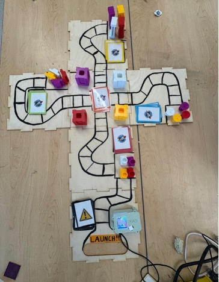
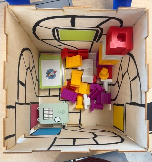
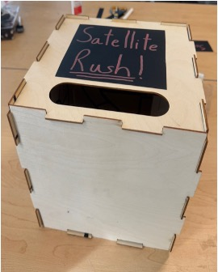
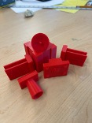
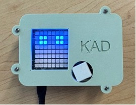

# Satellite-Rush
### ENGR-E 101 Innovation and Deisgn - Final Class Project

**This project is about teaching Highschool Juniors (11th grade) about Nasa Cube Satellites**

This was done through a board game where players collected pieces while moving around and answering questions

Below are images from my final project:

*This image is an overview of the full game*

  
  
  

  
  

